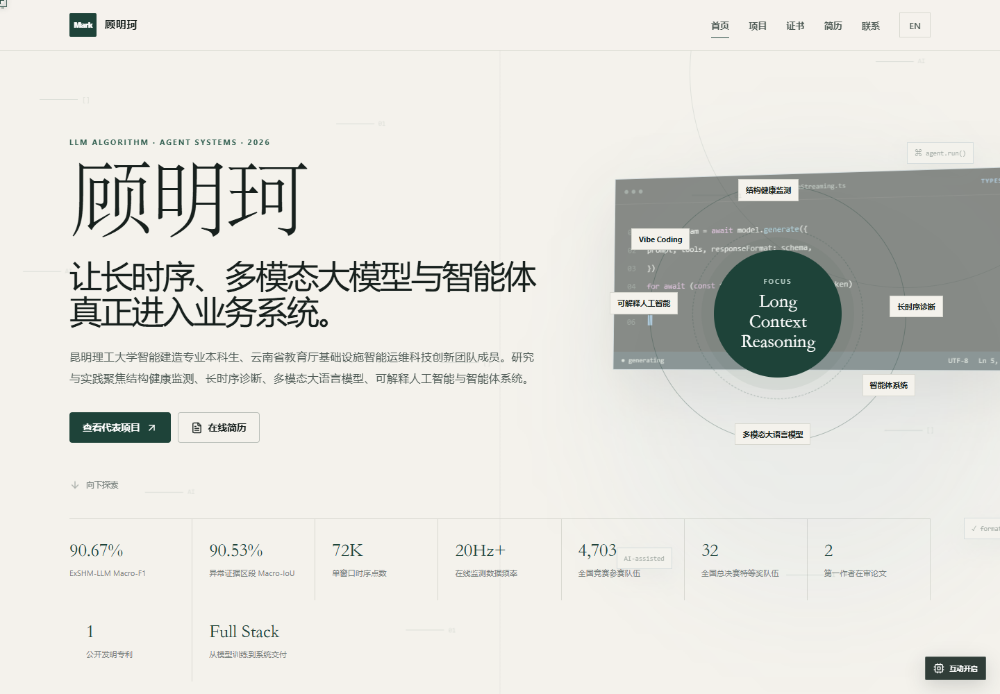
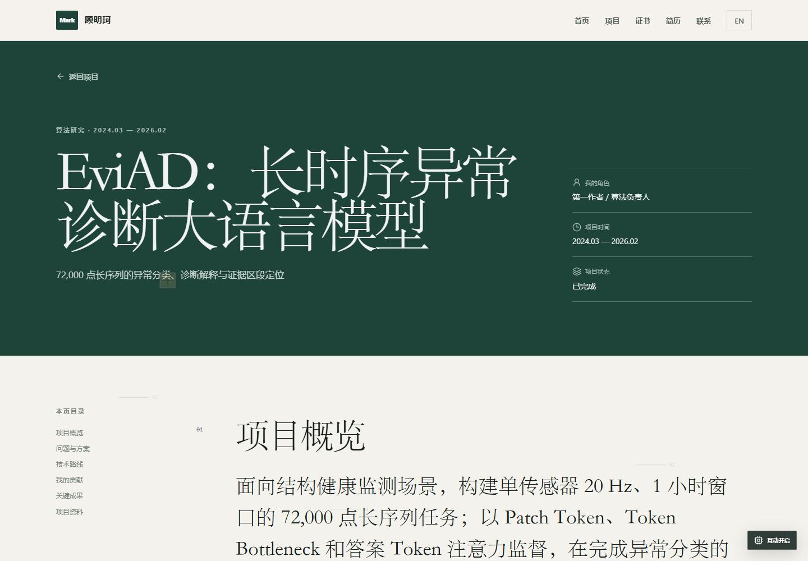
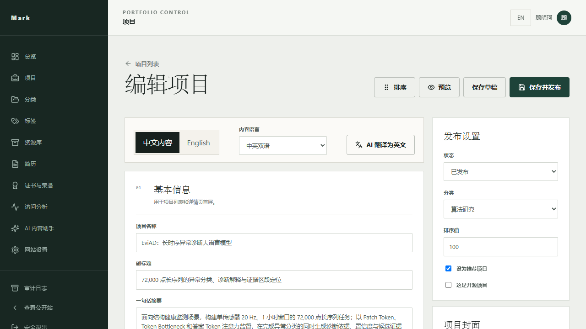

# EvidentFolio

<p align="center">
  <strong>An evidence-first portfolio and case-study CMS.</strong><br />
  Present the problem, your decisions, your contribution, and the proof—not just another grid of cards.
</p>

<p align="center">
  <a href="README.zh-CN.md">简体中文</a> ·
  Live demo ·
  <a href="docs/DEPLOYMENT.md">Deployment</a> ·
  <a href="CONTRIBUTING.md">Contributing</a>
</p>

<p align="center">
  <a href="https://github.com/gmkrxb/evidentfolio/actions/workflows/ci.yml"></a>
  <a href="https://github.com/gmkrxb/evidentfolio/stargazers"></a>
  <a href="https://github.com/gmkrxb/evidentfolio/pkgs/container/evidentfolio"></a>
  <a href="LICENSE"></a>
  
  
</p>



## Why EvidentFolio?

Hiring managers rarely need another list of technologies. They need a fast answer to four questions: what problem did you solve, what exactly did you own, how did you make decisions, and what evidence supports the result?

EvidentFolio is a self-hosted portfolio system built around that reading flow. It combines a polished public site, a real content and media admin, explainable attention analytics, multilingual content, and an optional OpenAI-compatible writing assistant. Your database and uploads remain under your control.

## Highlights

- Case-study projects with configurable sections, heading levels, mixed media, reusable albums, credentials, links, outcomes, and drag-to-reorder outlines.
- Asset library with folders, global search, SHA-256 duplicate detection, safe previews, dependency checks, stable UUID URLs, thumbnails, video metadata, and Range requests.
- Multiple résumé versions with progressive PDF.js rendering, page progress, zoom, fullscreen, download analytics, CMaps, and no browser PDF toolbar dependency.
- Credentials and honors linked bidirectionally to projects, with image/PDF previews and lightbox viewing.
- Anonymous attention analytics: visits, sessions, paths, dwell time, devices, referrers, UTM data, downloads, media progress, and an explainable high-attention score.
- Chinese/English routes and database-backed content translations; fixed UI copy lives in extendable language packages.
- Optional OpenAI-compatible AI configuration for model discovery, streaming translation, and structured résumé-to-draft import.
- HttpOnly sessions, CSRF protection, Argon2 passwords, login throttling, audit logs, trusted-proxy IP handling, and safe upload validation.
- SQLite WAL, Alembic migrations, startup integrity checks, pre-migration backups, Docker health checks, Nginx caching, SPA fallback, and PDF worker MIME handling.
- Blank, privacy-safe first launch. EvidentFolio never inserts the maintainer's résumé, projects, certificates, or sample identity.

## Screens

| Public case study | Content management |
| --- | --- |
|  |  |

The public demo contains the maintainer's own portfolio data; the open-source installation starts empty: **demo**.

## Tech stack

| Layer | Technology |
| --- | --- |
| Public site and admin | Vue 3, TypeScript, Vite, Vue Router, Pinia, CSS tokens, Lucide / Element Plus icons |
| API | Python 3.12, FastAPI, Pydantic, SQLAlchemy 2, Uvicorn |
| Data | SQLite WAL, Alembic, UUID public identifiers |
| Media | Pillow, PyMuPDF, PDF.js, ffmpeg/ffprobe, Nginx Range responses |
| Security | Argon2, HttpOnly cookies, CSRF, rate limits, audit logs, MIME and path validation |
| Delivery | Nginx, Docker, Render Blueprint, optional Vercel frontend |

## Quick start with Docker

The published image contains the frontend, backend, Nginx, ffmpeg, and runtime. Only the database and uploaded files are bind-mounted.

```bash
mkdir -p evidentfolio/data evidentfolio/uploads
docker run -d --name evidentfolio --restart unless-stopped -p 8080:80 \
  -e EVIDENTFOLIO_SECRET_KEY="$(openssl rand -hex 32)" \
  -e EVIDENTFOLIO_TRUSTED_HOSTS="localhost,127.0.0.1,your-domain.example" \
  -e EVIDENTFOLIO_SECURE_COOKIES=false \
  -v "$PWD/evidentfolio/data:/app/data" \
  -v "$PWD/evidentfolio/uploads:/app/uploads" \
  ghcr.io/gmkrxb/evidentfolio:latest
```

Open `http://localhost:8080`. A blank installation redirects to `/admin/login`, where the one-time setup creates the first administrator and basic site identity. The setup endpoint closes as soon as an administrator exists.

For HTTPS, set `EVIDENTFOLIO_SECURE_COOKIES=true` and list the real host in `EVIDENTFOLIO_TRUSTED_HOSTS`.

## Upgrading an existing database

Keep the same `data/` and `uploads/` mounts, pull the new image, and recreate the container. Every startup performs this sequence before accepting traffic:

1. Verify database and upload paths are writable.
2. Run SQLite `PRAGMA quick_check`.
3. Create a one-time SQLite backup in `data/migration-backups/` for the current revision.
4. Run `alembic upgrade head`.
5. Run foreign-key and post-migration checks.
6. Start the single Uvicorn worker and Nginx only if all checks pass.

```bash
docker pull ghcr.io/gmkrxb/evidentfolio:latest
docker rm -f evidentfolio
# Run the same docker run command again with the existing mounts.
docker logs -f --tail 160 evidentfolio
```

Old content is preserved. A failed check or migration stops startup instead of serving a partially migrated database. See [Deployment](docs/DEPLOYMENT.md) for backup, rollback, reverse proxy, source deployment, and external frontend/backend layouts.

## Source development

Prerequisites: Python 3.12, ffmpeg, Node.js 22+, and `cnpm`.

```bash
# Backend (uses the selected Python installation; no project virtualenv is required)
python -m pip install -r backend/requirements.txt
cp deploy/config/config.example.py deploy/config/config.py
cd backend
python -m app.startup preflight
python -m alembic -c alembic.ini upgrade head
python -m app.startup postflight
python -m uvicorn app.main:app --host 127.0.0.1 --port 8000 --workers 1

# Frontend, in another terminal
cd frontend
cnpm install
cnpm run dev
```

The Vite development proxy connects `/api` to `127.0.0.1:8000`. No API domain is hardcoded. For a separately hosted public frontend, set `VITE_API_BASE_URL` at build time.

## Deployment choices

| Method | Best for | Persistence |
| --- | --- | --- |
| `ghcr.io/gmkrxb/evidentfolio:latest` | Simplest self-hosted deployment | Bind-mount `/app/data` and `/app/uploads` |
| Build `Dockerfile.unified` | Auditable one-image deployment | Same two mounts |
| External frontend/backend/runtime packages | Independent updates | External frontend, backend, data, uploads, and Python config |
| Render Blueprint | Managed full-stack deployment | Persistent Render disk required |
| Vercel frontend | Public read-only frontend in front of an existing API | Data remains on the API host |
| Direct source | Development and custom infrastructure | Configure paths in `config.py` |

[](https://render.com/deploy?repo=https://github.com/gmkrxb/evidentfolio)
[](https://vercel.com/new/clone?repository-url=https://github.com/gmkrxb/evidentfolio&root-directory=frontend&env=VITE_API_BASE_URL)

Vercel is frontend-only because SQLite and uploads require a persistent filesystem. For same-origin admin cookies, prefer the all-in-one image or proxy `/api` through your own domain. Render uses the included persistent-disk Blueprint.

## Configuration

Two production styles are supported without relying on a `.env` file:

- Docker image: variables prefixed with `EVIDENTFOLIO_`; the required value is `EVIDENTFOLIO_SECRET_KEY`.
- Source or external-runtime deployment: copy `deploy/config/config.example.py` to the ignored `config.py`, then mount or point `PORTFOLIO_CONFIG` to it.

Never commit `config.py`, API keys, databases, uploads, or migration backups. AI provider credentials are encrypted before database storage using the configured secret key.

## Project map

See [Project structure](docs/PROJECT_STRUCTURE.md) for the responsibility of every first-party top-level file and code directory. PDF.js CMaps, fonts, and WASM are grouped as vendored runtime assets and retain their upstream licenses.

## Quality gates

```bash
cd frontend
cnpm run type-check
cnpm run test
cnpm run build

cd ../backend
pytest

cd ..
docker build --platform linux/amd64 -f Dockerfile.unified -t evidentfolio:local .
```

The test suite covers initialization closure, login and CSRF, project CRUD and visibility, UUID access, upload security, path traversal, folder dependencies, analytics, bilingual content, AI-key redaction, empty database migration, and previous-version migration with content preservation.

## Contributing and security

Read [CONTRIBUTING.md](CONTRIBUTING.md) before opening a pull request. PRs must be focused, tested, documented, and free of personal data or generated databases. Security issues should follow [SECURITY.md](SECURITY.md), not a public issue.

- [Architecture](docs/ARCHITECTURE.md)
- [Deployment guide](docs/DEPLOYMENT.md)
- [API guide](docs/API.en.md)
- [Changelog](CHANGELOG.md)
- [Code of Conduct](CODE_OF_CONDUCT.md)

## Star history

[](https://star-history.com/#gmkrxb/evidentfolio&Date)

## License

[MIT](LICENSE) © 2026 Mingke Gu and EvidentFolio contributors.
